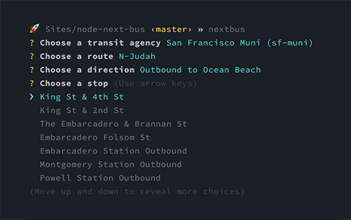

node-next-bus
=============

Interactive command line interface for public transit predictions supported by NextBus web services.

<div style="max-width: 500px">
  
</div>

***

#### Quick Start

Clone and cd into the repo.
```
$ git clone git@github.com:nathanbuchar/node-next-bus.git && cd node-next-bus
```

Create a globally-installed symbolic link for this package.
```
$ npm link
```

Then simply call the `nextbus` binary.
```
$ nextbus
```

***

&copy; 2016 [Nathan Buchar]. All rights reserved.


[Nathan Buchar]: mailto:hello@nathanbuchar.com
